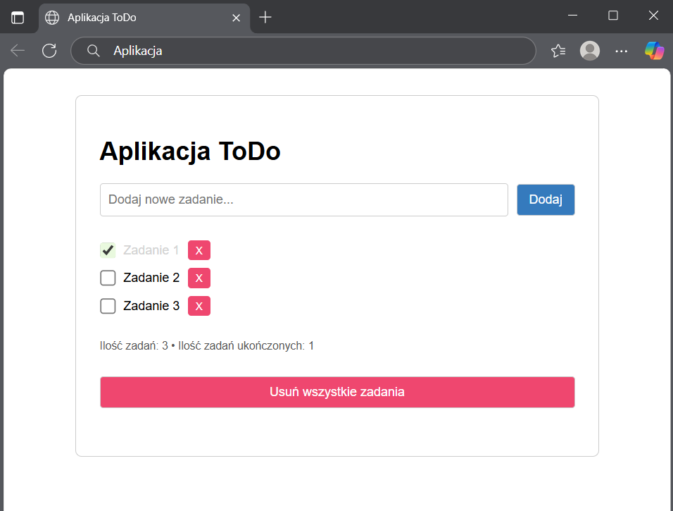

# Aplikacja ToDo

**Prosta aplikacja ToDo stworzona w JavaScript, umożliwiająca zarządzanie zadaniami.**

Aplikacja pozwala na:

- **Dodawanie nowych zadań**
- **Oznaczanie zadań jako ukończone**
- **Usuwanie pojedynczych zadań**
- **Usuwanie wszystkich zadań**
- **Zliczanie zadań**
- **Przechowywanie zadań w pamięci przeglądarki**

 Zrzut ekranu:

