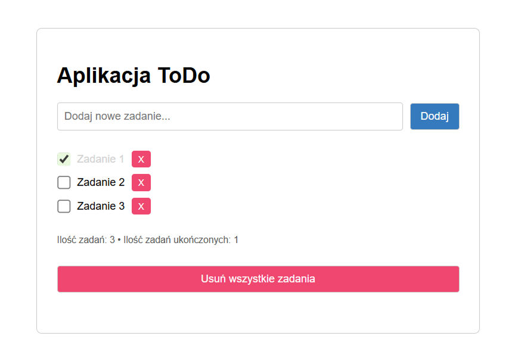

# Aplikacja ToDo

**Prosta aplikacja ToDo stworzona w JavaScript, umożliwiająca zarządzanie zadaniami.**

Aplikacja pozwala na:

- Dodawanie nowych zadań
- Oznaczanie zadań jako ukończone
- Usuwanie pojedynczych zadań
- Usuwanie wszystkich zadań
- Zliczanie zadań
- Przechowywanie zadań w pamięci przeglądarki

## Technologie

- HTML5
- CSS
- JavaScript
- LocalStorage

## Instalacja i uruchomienie

Aplikacja nie wymaga instalacji ani dodatkowych zależności.

1. Pobierz repozytorium

2. Otwórz plik index.html w przeglądarce
lub uruchom projekt przez lokalny serwer (np. Live Server w Visual Studio Code).

